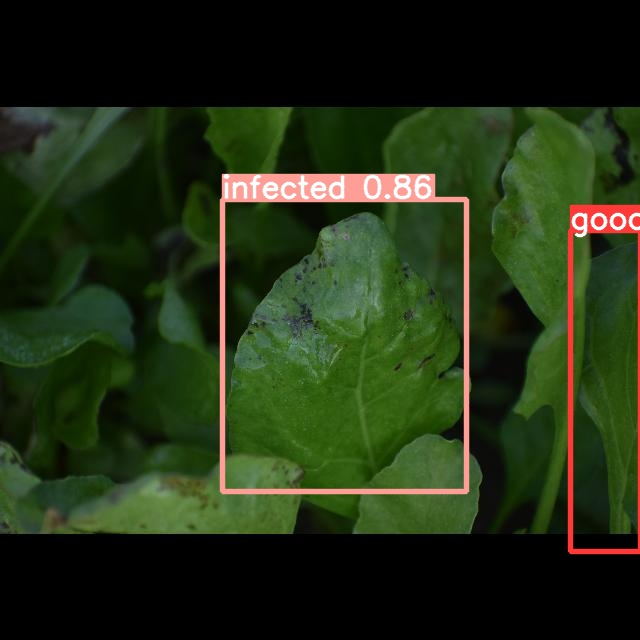

# Spinach Leaf Disease Detection on Raspberry Pi 4 (YOLOv5 + PyTorch)

A low-cost crop disease detector: a custom YOLOv5s model trained on 418 spinach leaf photos we collected from farms, deployed on a Raspberry Pi 4 (4 GB) with a camera.

| | |
|---|---|
| Classes | good, infected, yellow |
| Dataset | 418 images, labelled and augmented in Roboflow |
| Model | YOLOv5s (PyTorch), 640 px, trained on Google Colab |
| Validation result | 0.70 mAP@0.5 on 70 images (precision 0.64, recall 0.70) |
| Hardware | Raspberry Pi 4, 64-bit Raspberry Pi OS, USB/Pi camera |

 
This repo include all the necessary files to run custom Yolo Pytorch model on Raspberry pi 4. We have created a crop disease detection custom model using yolo V5 algorithm, and later deploy the model on Raspberry Pi 4(RAM: 4GB). The motive is to build a cost effective model or system for agriculture purpose. 

<h3>Data We Used</h3>
We have collected the data of spinach leaves from the farms. Data is of high quality images, all are collected by ourselves. We have infected and good crop images, total we have 418 images in our dataset.

<h3>Annotation, Split, PreProcessing & Augmentation</h3>
Roboflow is used for annotating all 418 images. Images were annotated as "infected", "good" & "yellow". 
After all this the data is split in train ,test & valid dataset using roboflow. Split has been done automatically by roboflow, you can also set the percentage of the split. If you want to transfer any image from one dataset(train, valid, test) to another you are allowed to do that too.
Roboflow also give us tool for pre-processing and augmentation. In pre-processing we have auto-orient,Stretch to, Fill with center crop, Fit within, Fit reflect edges, Fit black edges, Fit white edges. While in augmentation we have Random Noise, Blur, Exposure, Random Shear, Random Crop, 90 Degree Rotations, Flip.

<h3>Training</h3>
You can look into customModel.ipynb where each and every steps of model training is given. Do not forget to copy-paste api key of your custom dataset from Roboflow. 

<h3>Deploy custom Model on Raspberry pi 4</h3>
- You must have 64-bit Raspberry pi OS installed on your Raspberry Pi (or visit https://www.raspberrypi.com/software/)  
- Follow the steps : 
    step 1: Open terminal, paste "$ sudo git clone https://github.com/14harshaldhote/Yolo-Pytorch-Crop-Disease-DETECTION_model-on-raspberryPi4" 
    step 2: Go inside the repo "$ cd Yolo-Pytorch-Crop-Disease-DETECTION_model-on-raspberryPi4"  
    step 3: "$ cd yolov5rpi4" 
    step 4: "$ ls" using this command you will get to see a bash file named install.sh 
    step 5: "$ sudo chmod 775 install.sh"  
    step 6: "$ ls" now your file comes in green colour  
    step 7: Run script file "$ sudo ./install.sh" as this command run all the dependencies like torchVision, pyTorch, etc. get install on your raspberry pi 
    step 8: Come out of all the folders using "$ cd"  
    step 9: Install Yolo V5 "$ sudo pip3 install yolov5" 
    step 10: You need to change the ownership "$  sudo chown -R pi:pi ***path of your yolov5 file***" in mine the command was "$  sudo chown -R pi:pi /usr/local/lib/Python-3.8/dist-packages/yolov5" 
    step 11: You can do some path changes in detect.py file according to need (like for giving image data for testing or saving the result ) 
    step 12: To run detect.py file "$ sudo yolov5 detect" or if you have camera attached to it "$ sudo yolov5 detect --source 0" here 0 is the index number of the camera device 
    step 13: You will get the result on the folder which you have or if you are running on camera you get the results on terminal
    
    
 
Hope this repo helped you to deploy your own custom model on raspberry pi 4
<h4> THANK YOU</h4>
    

