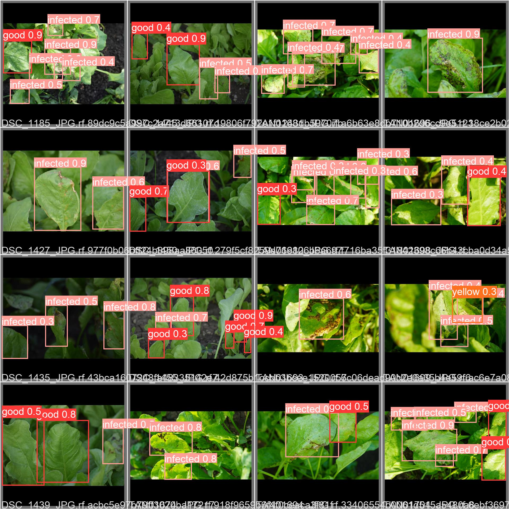
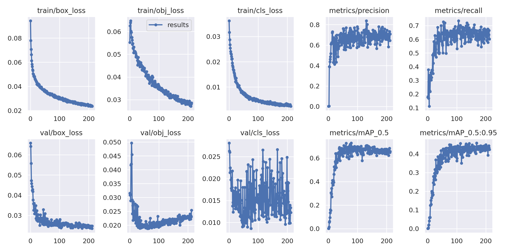
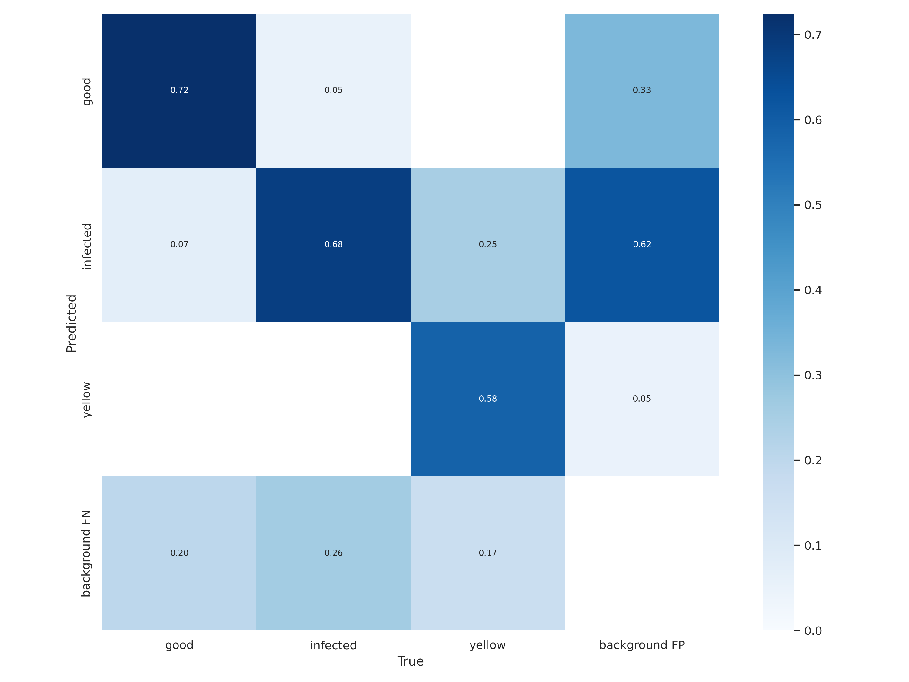

# Spinach Leaf Disease Detection on Raspberry Pi 4 (YOLO + FastAPI)

[](https://github.com/14harshaldhote/Yolo-Pytorch-Crop-Disease-DETECTION_model-on-raspberryPi4/actions/workflows/tests.yml)



A low-cost crop disease detector for small farms. We trained a custom **YOLOv5s** model on 418 spinach leaf photos we collected ourselves and run it on a **Raspberry Pi 4 (4 GB)** with a camera, so it can flag diseased leaves in the field without a GPU or a cloud connection. The model is served by a secured **FastAPI** service on **ONNX Runtime**, which needs no PyTorch on the Pi.

| | |
|---|---|
| Classes | `good`, `infected`, `yellow` |
| Dataset | 418 farm photos, labelled and augmented in Roboflow ([public on Roboflow Universe](https://universe.roboflow.com/ghrce-a8zlp/vf-ystlc/dataset/2), CC BY 4.0) |
| Model | YOLOv5s, 7.25M parameters, 640 px input, trained in PyTorch on Google Colab |
| Result | **0.70 mAP@0.5** on the 70-image validation set (precision 0.64, recall 0.70) |
| Serving | FastAPI + ONNX Runtime, API key auth, upload limits, rate limiting, Docker image |
| Hardware | Raspberry Pi 4 (4 GB), 64-bit Raspberry Pi OS, USB or Pi camera |
| Weights | [`weights/best.onnx`](weights/best.onnx) for the API, [`weights/best.pt`](weights/best.pt) for PyTorch |

## Contents

- [Quick start](#quick-start)
- [REST API](#rest-api)
- [Deploy on Raspberry Pi 4](#deploy-on-raspberry-pi-4)
- [Dataset](#dataset)
- [Training](#training)
- [Results](#results)
- [Development and tests](#development-and-tests)
- [Repository layout](#repository-layout)
- [Troubleshooting](#troubleshooting)

## Quick start

```bash
git clone https://github.com/14harshaldhote/Yolo-Pytorch-Crop-Disease-DETECTION_model-on-raspberryPi4.git
cd Yolo-Pytorch-Crop-Disease-DETECTION_model-on-raspberryPi4
python3 -m venv .venv && source .venv/bin/activate
pip install -r requirements-api.txt

export API_KEY=$(python3 -c "import secrets; print(secrets.token_urlsafe(32))")
uvicorn app.main:app --host 0.0.0.0 --port 8000
```

```bash
curl -H "X-API-Key: $API_KEY" -F "file=@leaf.jpg" http://localhost:8000/v1/detect
```

Interactive docs are at `http://localhost:8000/docs`. Or run it with Docker (works on the Pi too):

```bash
docker build -t crop-disease-api .
docker run -d -p 8000:8000 -e API_KEY=change-me --restart unless-stopped crop-disease-api
```

## REST API

| Method | Path | Auth | Purpose |
|---|---|---|---|
| `GET` | `/health` | none | Liveness check: `{"status": "ok"}` |
| `GET` | `/v1/model` | API key | Model name, classes, input size, thresholds |
| `POST` | `/v1/detect` | API key | Detect leaves in one uploaded image |

`POST /v1/detect` takes a multipart `file` (JPEG, PNG, WebP or BMP) and two optional query parameters: `conf` (0.01 to 1, overrides the confidence threshold) and `annotate=true` (returns the JPEG with boxes drawn instead of JSON, with counts in the `X-Detection-Counts` header).

```json
{
  "model": "best.onnx",
  "image": {"width": 640, "height": 640},
  "inference_ms": 54.6,
  "counts": {"good": 0, "infected": 1, "yellow": 0},
  "diseased": true,
  "detections": [
    {"class_id": 1, "label": "infected", "confidence": 0.8642,
     "box": {"x1": 230.1, "y1": 204.1, "x2": 455.1, "y2": 480.2}}
  ]
}
```

Box coordinates are pixels in the uploaded image.

### Security

- **API key:** set `API_KEY` and every `/v1` request must send it in the `X-API-Key` header. Keys are compared in constant time. Without `API_KEY` the service runs open and logs a warning at startup.
- **Upload checks:** bodies over `MAX_UPLOAD_MB` are refused before they are read. The real image format is read from the file header, not trusted from the client, and images over `MAX_IMAGE_PIXELS` are refused before decoding, which blocks decompression bombs.
- **Rate limiting:** `RATE_LIMIT_PER_MINUTE` requests per client IP (in memory, single process).
- **No leaks:** errors return a generic message without stack traces, and responses carry `nosniff`, `X-Frame-Options: DENY` and `no-store` headers.
- **Least privilege:** the Docker image and systemd service run as a non-root user, and the service is sandboxed (`ProtectSystem=strict`, `NoNewPrivileges`).
- For access from outside your network, put it behind HTTPS (for example Caddy or Nginx) and set `ENABLE_DOCS=false`.

### Configuration

All settings are environment variables:

| Variable | Default | Meaning |
|---|---|---|
| `API_KEY` | empty (auth off) | Required value of the `X-API-Key` header |
| `MODEL_PATH` | `weights/best.onnx` | Any YOLOv5, YOLOv8 or YOLO11 ONNX export |
| `CONF_THRESHOLD` | `0.4` | Minimum confidence to report a detection |
| `IOU_THRESHOLD` | `0.45` | Overlap threshold for non-maximum suppression |
| `MAX_UPLOAD_MB` | `10` | Largest accepted upload |
| `MAX_IMAGE_PIXELS` | `40000000` | Largest accepted image (width × height) |
| `MAX_CONCURRENCY` | `2` | Inferences that run at the same time |
| `ORT_THREADS` | `0` (auto) | ONNX Runtime threads per inference |
| `RATE_LIMIT_PER_MINUTE` | `60` | Requests per client IP per minute, `0` disables |
| `CORS_ORIGINS` | empty | Comma-separated origins allowed to call the API from a browser |
| `ENABLE_DOCS` | `true` | Serve `/docs` and `/openapi.json` |

### Why ONNX Runtime

The API runs the same trained model exported to ONNX (`python export.py --include onnx`). On the 39 test images it gives the same 62 boxes as PyTorch, all within 0.5 px. On a 4-core x86 cloud machine it took about 55 ms per image, against about 130 ms for PyTorch `detect.py`, and it installs from normal pip wheels on the Pi instead of custom PyTorch builds. We have not benchmarked it on a Pi yet.

## Deploy on Raspberry Pi 4

**You need:** a Raspberry Pi 4 (4 GB recommended), a 16 GB+ microSD card, a USB webcam or Pi camera, and **64-bit Raspberry Pi OS** (Bullseye or Bookworm) from the [Raspberry Pi Imager](https://www.raspberrypi.com/software/). Check with `uname -m`, which must print `aarch64`.

**1. Install**

```bash
git clone https://github.com/14harshaldhote/Yolo-Pytorch-Crop-Disease-DETECTION_model-on-raspberryPi4.git
cd Yolo-Pytorch-Crop-Disease-DETECTION_model-on-raspberryPi4
./scripts/install_pi.sh --service
```

The script creates a virtual environment in `.venv`, installs `requirements-api.txt`, writes a random `API_KEY` to `.env` (readable only by you), and with `--service` installs a systemd service that starts the API on boot and restarts it if it crashes. Leave out `--service` to start it by hand.

```bash
cat .env                                      # your API key
curl http://localhost:8000/health
sudo systemctl status crop-disease-api        # logs: journalctl -u crop-disease-api -f
```

**2. Live camera detection (no server)**

```bash
.venv/bin/python scripts/camera_detect.py --source 0          # prints counts and FPS per frame
.venv/bin/python scripts/camera_detect.py --source 0 --show   # preview window, needs a desktop and opencv-python
.venv/bin/python scripts/camera_detect.py --source 0 --save field.mp4
```

### Original PyTorch route (legacy)

The first version of this project ran `detect.py` with PyTorch on the Pi. That still works, but only on **64-bit Bullseye with Python 3.9**, because `yolov5rpi4/install.sh` downloads PyTorch 1.8 and TorchVision 0.9 wheels built for that version.

```bash
cd yolov5rpi4 && chmod +x install.sh && ./install.sh && cd ..
pip3 install -r requirements.txt
python3 detect.py --source 0 --conf-thres 0.4      # defaults to weights/best.pt and data/spinach.yaml
```

## Dataset

- **Collection:** 418 high-resolution photos of spinach leaves taken by our team on local farms.
- **Labels:** every leaf was boxed in [Roboflow](https://roboflow.com) as `good`, `infected` or `yellow`.
- **Split:** Roboflow's automatic train / valid / test split (70 validation images, 39 test images).
- **Preprocessing:** auto-orient and resize to 640×640.
- **Augmentation:** random noise, blur, exposure, shear, crop, 90° rotations and flips.

Download it from Roboflow in **YOLOv5 PyTorch** format and unzip it into a folder named `vf-2` at the repo root. `data/spinach.yaml` already points there.

```python
from roboflow import Roboflow
rf = Roboflow(api_key="YOUR_ROBOFLOW_API_KEY")   # keep keys out of git
rf.workspace("ghrce-a8zlp").project("vf-ystlc").version(2).download("yolov5")  # creates ./vf-2
```

## Training

### YOLOv5 (how the current model was trained)

Everything we ran is in [`customModel.ipynb`](customModel.ipynb) (Colab, NVIDIA A100). From this repo:

```bash
pip install -r requirements.txt
python train.py --img 640 --batch 32 --epochs 500 --weights yolov5s.pt --cache
python export.py --weights runs/train/exp/weights/best.pt --include onnx   # for the API
```

`train.py` now defaults to `data/spinach.yaml`, `models/custom_yolov5s.yaml` and the hyperparameters we used (`runs/train/dt_result5/hyp.yaml`). Early stopping (patience 100) ended our run at epoch 213, about 16 minutes on the A100; the best checkpoint came from epoch 112.

### YOLO11 (newer architecture)

[`scripts/train_yolo11.py`](scripts/train_yolo11.py) retrains the detector with Ultralytics YOLO11 on the same dataset and exports `weights/yolo11.onnx`, which the API and camera script load as is:

```bash
pip install ultralytics
python scripts/train_yolo11.py --model yolo11s.pt --epochs 300   # use yolo11n.pt for more speed on the Pi
MODEL_PATH=weights/yolo11.onnx uvicorn app.main:app --port 8000
```

We have not trained a YOLO11 model on the full dataset yet, so there is no YOLO11 score to compare. Switch only if its mAP beats 0.702.

## Results

Validation of `best.pt` on 70 images (233 labelled leaves), from the notebook output:

| Class | Labels | Precision | Recall | mAP@0.5 | mAP@0.5:0.95 |
|---|---:|---:|---:|---:|---:|
| **all** | 233 | 0.635 | 0.701 | **0.702** | 0.456 |
| good | 69 | 0.586 | 0.739 | 0.733 | 0.512 |
| infected | 152 | 0.637 | 0.697 | 0.676 | 0.373 |
| yellow | 12 | 0.681 | 0.667 | 0.697 | 0.482 |

`yellow` has only 12 validation labels, so its numbers are noisy.

| Training curves | Confusion matrix |
|---|---|
|  |  |

More plots and the per-epoch `results.csv` are in [`runs/train/dt_result5`](runs/train/dt_result5). Predictions on all 39 test images are in [`runs/detect/exp`](runs/detect/exp).

## Development and tests

```bash
pip install -r requirements-dev.txt
pytest                      # 29 tests: detector accuracy and box mapping, every API endpoint, auth, limits
```

The tests run the real model on a test image. GitHub Actions runs them and a lint check on every push and pull request.

## Repository layout

```
.
├── app/                       # FastAPI service
│   ├── main.py                #   routes, upload validation, middleware
│   ├── detector.py            #   ONNX Runtime inference, letterbox, NMS (YOLOv5/v8/11)
│   ├── security.py            #   API key check, rate limiter
│   └── config.py              #   settings from environment variables
├── tests/                     # pytest suite
├── scripts/
│   ├── install_pi.sh          # one-command Pi setup (+ systemd service)
│   ├── crop-disease-api.service
│   ├── camera_detect.py       # live camera detection without a server
│   └── train_yolo11.py        # retrain with YOLO11 and export to ONNX
├── weights/best.onnx          # trained model for the API
├── weights/best.pt            # trained model for PyTorch (best epoch); last.pt is the final epoch
├── data/spinach.yaml          # class names and dataset paths
├── Dockerfile
├── customModel.ipynb          # original Colab training notebook
├── train.py, val.py, detect.py, export.py, models/, utils/   # YOLOv5 code
├── yolov5rpi4/install.sh      # legacy PyTorch install for the Pi
└── runs/                      # training logs and test predictions
```

The YOLOv5 code is a snapshot of [ultralytics/yolov5](https://github.com/ultralytics/yolov5) at commit `fbe67e4` (July 2022), the version the model was trained with, patched to run with current NumPy and Pillow.

## Troubleshooting

- **`401 Invalid or missing API key`:** send the key from `.env` in the `X-API-Key` header.
- **`413` or `415` from `/v1/detect`:** the file is too large or not a JPEG, PNG, WebP or BMP image. Resize big photos or raise `MAX_UPLOAD_MB`.
- **Camera not found with `--source 0`:** run `ls /dev/video*` to see which index your camera uses. For the Pi camera module on Bullseye, enable the legacy camera in `sudo raspi-config`; on Bookworm, a USB webcam is the simplest option.
- **`ERROR: ... is not a supported wheel on this platform` from `yolov5rpi4/install.sh`:** that legacy script only works on 64-bit Bullseye with Python 3.9. Use `scripts/install_pi.sh` instead.
- **Slow on the Pi:** set `ORT_THREADS=4` and `MAX_CONCURRENCY=1`, or retrain with `yolo11n.pt`.

## License

GPL-3.0, inherited from YOLOv5. See [LICENSE](LICENSE).
